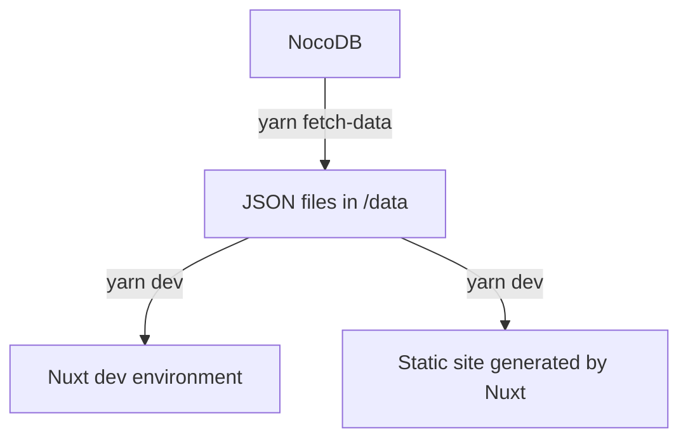

# 🤞 WeVis Promise Tracker

Thai politicians and parties promise tracker

## 🌎 Environment

- Production: https://promisetracker.wevis.info
- Staging: https://wevisdemo.github.io/promise-tracker

## 💻 Tech stack

- [NuxtJS](https://nuxtjs.org) with [Vue 2 and TypeScript](https://v2.vuejs.org/v2/guide/typescript.html#Basic-Usage)
- [TailwindCSS](https://tailwindcss.com)
- [Jest](https://jestjs.io) and [Vue Test Utils](https://v1.test-utils.vuejs.org/guides/#getting-started)
- [NocoDB](https://nocodb.com) as a database

## 📐 Architecture

The project use static site generator (SSG) strategy. In the pipeline, API is called once before the build time, which mean no API will be called after the static site is generated. To update the site after the data is updated, site needed to be built and deployed again.



- Promises and related data is store on WeVis's NocoDB which allow non-dev to maintain the data
- Use `yarn fetch-data` to download data from NocoDB, transform into JSON files in /data
- JSON files then will be loaded by Nuxt from `yarn dev` and `yarn build` command

## ⚽ Working style

- We use Github issue to track the progress.
  - Please assign yourself to the issue you are working on.
  - I don't want to force "HOW" to implement the issue and we can discuss everything on the issue.
  - Communication language doesn't matter. Feel free to use Thai or English.
- We use Trunk-based development.
  - No braches, we all push to main branch.
  - If the commit is related to a specific issue, add issue id in the commit message eg. `#21 Add button components`
  - Pull rebase `git pull --rebase` often. Before you start coding and pushing.
  - Continuous integration: don't leave your code without pushing overnight, push as much as you can without breaking the build.
  - Linter and formater will be run on commit, while test and build will be run on push so you can't push if it fail.
- Encourage to write component test with TDD (Test driven development) but it's not mandatory.
- Each time the code is pushed to main, Github Action will build and deploy to the staging environment.
- Use asynchonous communication. Let's try not to have meeting if not necessary.
  - For issue related discussion, please use Github issue
  - Other discussion can be done in slack

## 📂 Directory structure

Use `pascal-case` for every file name since Linux (eg. Github Action runner) is not case-incensitive, in contrary to Mac and Windows.

- `/components` Vue components
  - Put on the root if it's shared between pages
  - Put in the `/components/<page>/` if it's only used in that page
  - If components is too big or getting duplicated, you should split into several component which can also be group in sub-folder
- `/data` JSON promises and related data, including example one before fetching script is implemented.
- `/models` Data types (interface, enum, etc.) sharing across the project
- `/pages` Represent [Nuxt routing](https://nuxtjs.org/docs/directory-structure/pages)
- `/static` Static assets such as images
  - Before adding new assets, check first if it's already exist here.
  - `$config.path.base` can be used to reference `static` path (or base path)
  - `$config.path.images` can be used to reference `static/images` path
  ```vue
    <img :src="`${$config.path.images}/status/nodata.png`"
  ```
  - For SVG that can change the color (eg. button icon on hover), recommend in use inline svg with `currentColor` and Tailwind color preset
- `/tests` Test file
  - Recommend to mimick project structure eg. `/tests/components/component-name.test.ts`

## 💅 Styling and design system

- We used [WeVis Design System](https://wevisdemo.github.io/design-systems/) which provide
  - Utility classes for typography
  - Vue component
- For other styling customization beyond WeVis design system, use Tailwindcss
  - Color is defined in `tailwind.config.css` which naming should be related to Figma
  - Configuration is also available on http://localhost:3000/\_tailwind/ when dev server is running

## 🤝 License and Terms of Use

Please read WeVis's [Terms of Use](https://wevis.info/terms-of-use/)


**THANK YOU FOR ALL THE CONTRIBUTION ❤️**
